[](https://travis-ci.org/IBM/troubleshoot-with-openrtracing-and-istio)


# Use MicroProfile OpenTracing and distributed tracing with Istio to enhance system observability.

# Introduction

The shift toward distributed, container-based [microservice architectures](https://developer.ibm.com/articles/why-should-we-use-microservices-and-containers/) brings with it a number of benefits but also drawbacks. While Kubernetes makes it easier than ever to split up monoliths into multiple, smaller services that use multiple network requests to complete every transaction, engineers and operations teams face challenges in observability, problem determination and root cause analysis. 

[Istio](https://istio.io/), a joint effort between IBM, Google and Lyft creates a [service mesh](https://github.com/IBM/microservices-traffic-management-using-istio) that can be integrated into a container orchestration platform like Kubernetes.  While the set of technologies provided by Istio promises to enhance system observability, developers should be aware of new requirements to take advantage of these capabilities. 

In this pattern we'll look at how Open Liberty, MicroProfile and Open Tracing work alongside Istio and introduce the concept of distributed tracing, a way to capture, visualize and tell the story of what happens to an individual request. An application inside the mesh does need to do some extra work to propagate request context through the mesh. Open Liberty reduces the effort needed to instrument code to allow services to use distributed tracing.

# Tracing with Istio

One of the perhaps confusing areas of Istio is whether and how much an application has to be changed to take advantage of the distributed tracing support.  If you install the standard "Bookinfo" application, you will find that requests are traced and visible in Zipkin or Jaeger.  However, each service has code to [capture and propagate](https://github.com/istio/istio/blob/master/samples/bookinfo/src/details/details.rb#L130-L148) tracing headers. [(See documentation here)](https://istio.io/docs/tasks/telemetry/distributed-tracing/#understanding-what-happened). Manually handling context propagation is error prone, tedious and runs the risk creating gaps in the trace record. This is where Open Liberty and MicroProfile can help. When using the JAX-RS REST client alongside MicroProfile OpenTracing, spans and request errors are sent to the trace collector, and header-based trace ID propagation is handled automatically.

Along with deploying Open Liberty based containers, we also add a Node microservice not using any tracing library. This will demonstrate how to take advantage of Envoy and its understanding of tracing headers to connect its function to the broader request context. 

In this pattern, we'll go through these steps:

1. Installing Istio, enabling tracing and providing access to a dashboard.
2. Add MicroProfile and OpenTracing to Open Liberty project.
3. Run a simple microservice based application and explore a distributed tracing UI.
4. Investigate application failures using information from distributed tracing.

# Architecture

The sample app deployed here, a modified version of the [instrument-craft-shop](https://github.com/sdaschner/instrument-craft-shop) demo app from Sebastian Daschner, simulates an interface to a manufacturing facility. The details of the internals are less important than simply showing an application whose function is distributed across several microservices.

The sample app is made up of six services, shown below. The app is intended to be as simple as possible to demonstrate some features of distributed tracing without getting bogged down by details of its functionality. Some of the services will throw exceptions at random times to simulate failures that give us a chance to explore distributed tracing features.

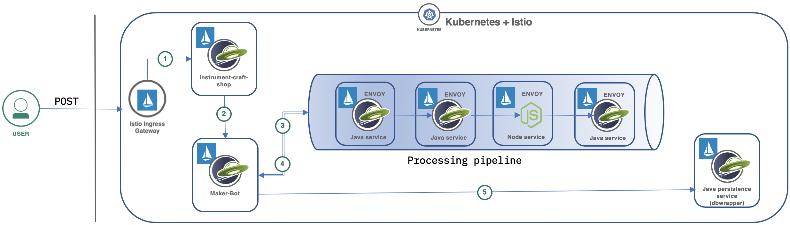

After a user sends a POST call into the ingress gateway public IP address, that request flows through the sample app as follows:

1. The Istio ingress gateway forwards the request to the service registered under the `instrument-craft-shop` name.
2. The `instrument-craft-shop` service calls to the `maker-bot` service, which then:
3. kicks off the "processing pipeline", which consists of four steps, each running in a separate pod.
4. the `maker-bot` service waits for the entire pipeline to complete.
5. If the pipeline completes, the final step in the sequence is a call from the `maker-bot` to the `dbwrapper` service which, in a real service could persist the object to a database, but in our case sleeps for a short period of time before returning a response.

## Included Components
- [Istio](https://istio.io/)
- [IBM Cloud Kubernetes Service](https://cloud.ibm.com/docs/containers?topic=containers-cs_ov#cs_ov)
- [Jaeger](https://www.jaegertracing.io/)

# Prerequisite
Create a Kubernetes cluster with either [Minikube](https://kubernetes.io/docs/getting-started-guides/minikube) for local testing or with [IBM Cloud Kubernetes Service](https://console.ng.bluemix.net/docs/containers/cs_ov.html#cs_ov) to deploy in cloud. Once your cluster is up, install [Helm](https://helm.sh/docs/using_helm/), which is required for Istio installation.

# Setup

Let's install the Istio service mesh installed on top of your Kubernetes cluster. 

```bash
$ curl -L https://git.io/getLatestIstio | sh -
$ mv istio-<version> istio # replace with version downloaded
$ kubectl create namespace istio-system
$ kubectl apply -f install/kubernetes/helm/helm-service-account.yaml
$ helm init --service-account tiller
```

When installing Istio, you are able install either a [Jaeger](https://www.jaegertracing.io/) or [Zipkin](https://zipkin.io/) tracing back-end. Most of the steps are the same with either service:

To install with a Jaeger back-end, run:

```
helm install kubernetes/helm/istio --name istio --namespace istio-system  --set grafana.enabled=true --set servicegraph.enabled=true --set tracing.enabled=true
```

for Zipkin:

```
helm install kubernetes/helm/istio --name istio --namespace istio-system  --set grafana.enabled=true --set servicegraph.enabled=true --set tracing.enabled=true --set tracing.provider=zipkin
```

- Enable automatic sidecar injection and increase trace sampling frequency.

Verify that the envoy side car is added to each deployed pod:

```
$ kubectl label namespace default istio-injection=enabled --overwrite
$ kubectl get namespace -L istio-injection
NAME             STATUS   AGE   ISTIO-INJECTION
default          Active   1d    enabled
```

By default the sampling frequency tracing is 1%. This is suitable for services where very high request volume would create too much noise in the tracing data. For our purposes, we can set it to 100% to allow all requests to be traced.

Run this command to edit the Istio pilot settings:
`$ kubectl -n istio-system edit deploy istio-pilot`

Find the parameter `PILOT_TRACE_SAMPLING`, set its value to 100 and save the changes.

```
       - name: PILOT_TRACE_SAMPLING
          value: "100"
```

Finally, set up port forwarding to access the tracing UI on your system:

- If Istio is installed with Jaeger:
```
kubectl port-forward -n istio-system $(kubectl get pod -n istio-system -l app=jaeger -o jsonpath={.items[0].metadata.name}) 16686:16686 &
```
and go to http://localhost:16686

- For Zipkin (if `tracing.provider=zipkin` was used) run:
```
 kubectl port-forward -n istio-system $(kubectl get pod -n istio-system -l app=zipkin -o jsonpath={.items[0].metadata.name}) 9411:9411 &
 ```
 and access the dashboard at http://localhost:9411
 
- Clone the sample application.

Create a working directory to clone this repo and to download Istio into: (note: will be moved to this repository after review)

```bash
$ mkdir ibm
$ cd ibm
$ git clone https://github.com/IBM/opentracing-istio-troubleshooting 
```

Run the deployment scripts. The Docker images for this pattern are already uploaded to Docker hub. 

```
$ ./deploy.sh
service/instrument-craft-shop unchanged
deployment.apps/instrument-craft-shop created
deployment.apps/maker-bot created
service/maker-bot unchanged
deployment.apps/dbwrapper created
service/dbwrapper unchanged
deployment.apps/pipeline-n1 created
service/pipeline-n1 unchanged
deployment.apps/pipeline-n2 created
service/pipeline-n2 unchanged
deployment.apps/pipeline-n3 created
service/pipeline-n3 unchanged
deployment.apps/pipeline-js created
service/pipeline-js unchanged
gateway.networking.istio.io/shop-gw created
virtualservice.networking.istio.io/craft-shop-svc created
```

Verify pods are running (each pod should have 2 containers)

```
$   kubectl get pods
NAME                                     READY   STATUS    RESTARTS   AGE
dbwrapper-7cbffb64fd-s9djp               2/2     Running   0          2m
instrument-craft-shop-86f8bbcb97-jn7xh   2/2     Running   0          2m
maker-bot-64ffbc7c65-pp9sr               2/2     Running   0          2m
pipeline-js-57c4dcd475-9bbcp             2/2     Running   0          31s
pipeline-n1-694c45bb8b-mkdgz             2/2     Running   0          2m
pipeline-n2-77b8d95b49-d7b5m             2/2     Running   0          2m
pipeline-n3-7dd8976ddb-rnwk8             2/2     Running   0          2m
```

Once services are running, find the `istio-ingressgateway` service external IP and port:

```
$  kubectl get svc -n istio-system istio-ingressgateway
NAME                   TYPE           CLUSTER-IP       EXTERNAL-IP     PORT(S)                                                                                                                   AGE
istio-ingressgateway   LoadBalancer   172.21.158.107   169.55.65.202   80:31380/TCP,443:31390/TCP,31400:31400/TCP,15011:31315/TCP,8060:31977/TCP,853:31762/TCP,15030:30709/TCP,15031:31912/TCP   26d
```

In this cluster, the external address is `169.55.65.202:31380`.   A request to the application can be sent with curl:

```
curl 169.55.65.202:31380/instrument-craft-shop/resources/instruments -i -XPOST -H 'count: 1'  -H 'Content-Type: application/json' -d '{"type":"GUITAR", "price":200}'
```

Without application instrumentation
--------------

Before we look at what we get with distributed tracing enabled, here's a screenshot from the tracing UI with Istio installed but *without* any application-level context propagation. (Open Tracing/zipkin configuration removed from Open Liberty and no manual header duplication.) Envoy reports each HTTP call to the trace collector but it creates new trace IDs for every span, so there's no way for the trace subsystem to link them into one request.

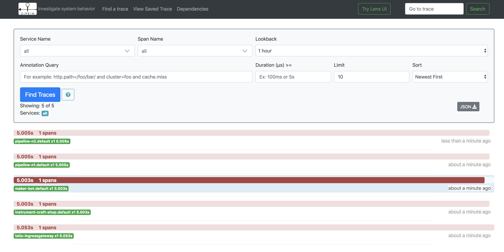


# MicroProfile Open Tracing vs. manual context propagation.

First, let's take a look at how context propagation is done manually.  Without a tracing library, headers in the Node service need to be copied from input to output to maintain the unified trace context:

```javascript
    var b3headers = ["x-b3-traceid",
	                 "x-b3-spanid",
					 "x-b3-sampled",
					 "x-b3-parentspanid"];
    axios.defaults.headers.post = {};
    b3headers.forEach(function(hdr) {
        var value = req.headers[hdr];
        if (value) {
            axios.defaults.headers.post[hdr] = value;
        }
      });
```

When viewed in Jaeger or Zipkin, the Node service is still visible among the Java applications, since the traceid is consistent with trace IDs propagated by JAX-RS/mpOpenTracing, allowing it to be placed in context of other services. Every time a network call is made, these headers must be propagated, either manually or through a library that wraps network calls.

# Open Liberty changes to build Open Liberty Docker containers that enable trace propagation.

On the Open Liberty side, we're configuring trace reporting by modifying configuration in `server.xml`. Note that there are no changes in the Java code needed.  Since all REST calls use the JAX-RS client library - `javax.ws.rs.client.Client` and associated classes - new trace spans are sent to the trace collector during each call. The `x-b3-traceid` header is also preserved across calls, allowing non-Liberty services to be part of a unified trace.

1. Changes in `server.xml`

We add the `microProfile-2.1`, which brings in the entire suite of MicroProfile features, including JAX-RS and mpOpenTracing.  The Zipkin feature provides support for Zipkin compatible trace collector.  With the `opentracingZipkin` parameter, we point Liberty to the tracing collector in Istio. This address is valid for either a Zipkin or Jaeger based Istio installation, as Jaeger natively supports the Zipkin tracing format, and Istio maps its collector address to `zipkin.istio-system:9411`.  This address can be found by checking the startup arguments in any envoy proxy deployment:

```
$ kubectl describe pod maker-bot-64ffbc7c65-pp9sr | grep -A1 zipkinAddress
      --zipkinAddress
      zipkin.istio-system:9411
```

- server.xml:

```xml
   <featureManager>
      <feature>microProfile-2.1</feature>
      <feature>usr:opentracingZipkin-0.31</feature>
    </featureManager>

    <opentracingZipkin host="zipkin.istio-system" port="9411" />

```

2. Changes in the Dockerfile

In the Dockerfile, we are copying the `lib` directory that includes the zipkin user feature downloaded by Maven:

```
COPY target/liberty/wlp/usr/extension /opt/ol/wlp/usr/extension/
```

3. Changes in `pom.xml`

These sections in the `pom.xml` are necessary to download the zipkin user feature (see the full `pom.xml` here: [link to github])

```xml
    <properties>
        <zipkin.usr.feature>https://github.com/WASdev/sample.opentracing.zipkintracer/releases/download/1.2/liberty-opentracing-zipkintracer-1.2-sample.zip</zipkin.usr.feature>
    </properties>
```

And the plugin to download the user feature:

```xml
        <plugin>
          <groupId>com.googlecode.maven-download-plugin</groupId>
          <artifactId>download-maven-plugin</artifactId>
          <version>${version.download-maven-plugin}</version>
          <executions>
            <execution>
              <id>install-tracer</id>
              <phase>prepare-package</phase>
              <goals>
                <goal>wget</goal>
              </goals>
              <configuration>
                <url>${zipkin.usr.feature}</url>
                <unpack>true</unpack>
                <outputDirectory>${project.build.directory}/liberty/wlp/usr</outputDirectory>
              </configuration>
            </execution>
          </executions>
        </plugin>
```


Test Scenario: Normal request processing
------------------------

Let's take a look at one successful request.

Then, we'll make a single REST call to our service via the ingress IP/port found earlier:

`curl 169.55.65.202:31380/instrument-craft-shop/resources/instruments -i -XPOST -H 'count: 1'  -H 'Content-Type: application/json' -d '{"type":"GUITAR", "price":200}'`

Heading over to the dashboard, we'll see a trace that looks like this. Notice that we see the total time for the request (3.5s) and have separate spans for work done in each service.  Because both MicroProfile OpenTracing and the Envoy proxy (sidecar container) are sending traces to the collector, spans for both show up and are nearly identical in length, as the proxy adds very little latency to each call. (Since the JAX-RS integration with MicroProfile OpenTracing propagates the `x-b3-traceid` header value across network calls, the trace collector is able to combine information from both services.  This is also the reason our Node service (`pipeline-js` in the diagram here) is made part of this collection: even though it's not using an OpenTracing (or any tracing library) for that matter, we're able to see the work in the Node service in the context of the larger request. 

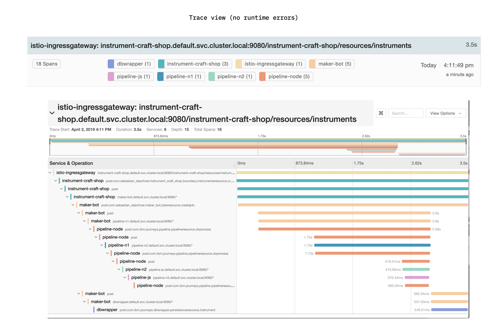

Error Scenario: Load testing and network timeout
------------------------

We'll use Artillery (http://artillery.io), a service load testing tool to drive many requests to our cluster. Once the run is complete, we can examine the distributed tracing dashboard to understand how the service behaves and examine any errors.


```
$ npm install -g artillery
$ artillery run load-test.yml 

All virtual users finished
Summary report @ 14:59:53(-0400) 2019-04-04
  Scenarios launched:  28
  Scenarios completed: 28
  Requests completed:  28
  RPS sent: 0.82
  Request latency:
    min: 747.1
    max: 25311.3
    median: 8253.1
    p95: 24145.1
    p99: 25311.3
  Scenario counts:
    build instrument: 28 (100%)
  Codes:
    204: 20
    500: 8

```

This launched 28 requests over the course of 10 seconds; the application successfully completed only 8 out of the 28 requests. If we load the service in the Jaeger UI and sort by most recent traces, Jager builds a scatter plot showing at a glance how the service performed; we can examine the outliers by clicking on them (red arrow).

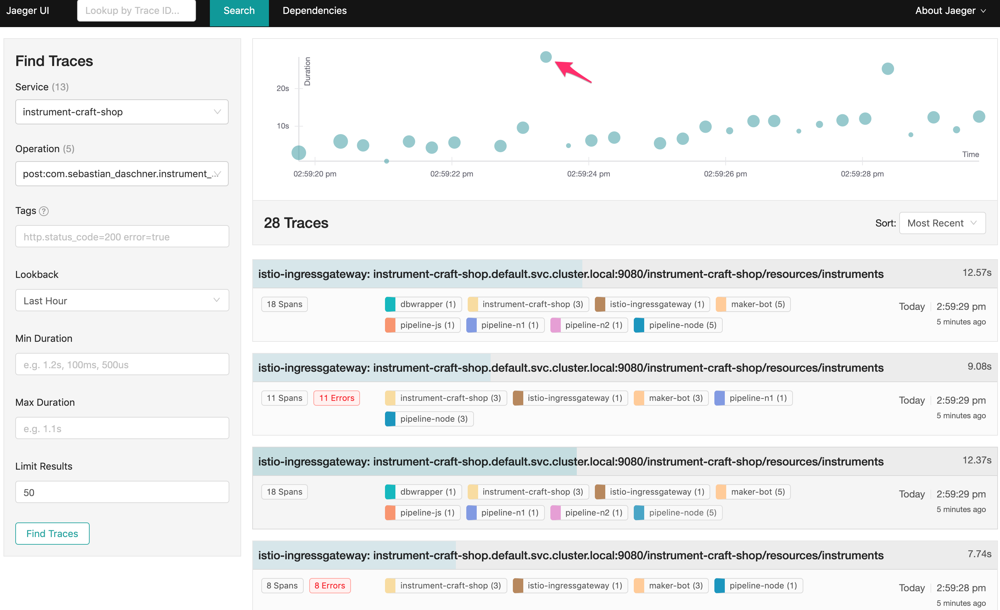

The result shows us that the `pipeline-n1` process had an extremely long runtime, ultimately resulting in a network timeout upstream:

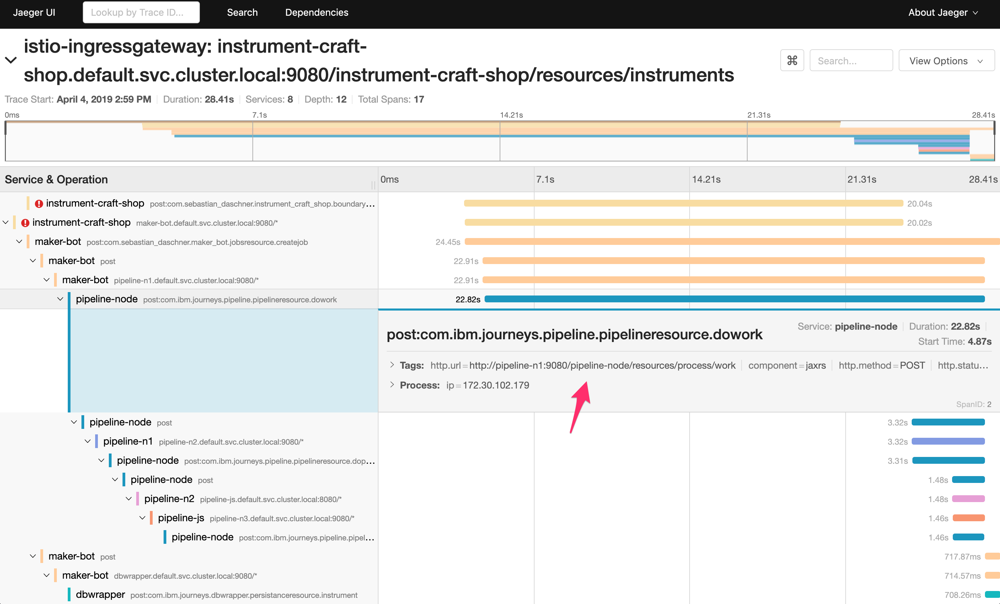

Upstream timeout.  Note the `Logs` is available due to JAX-RS instrumentation through Open Liberty tracing instrumentation, which is not available directly through Envoy.

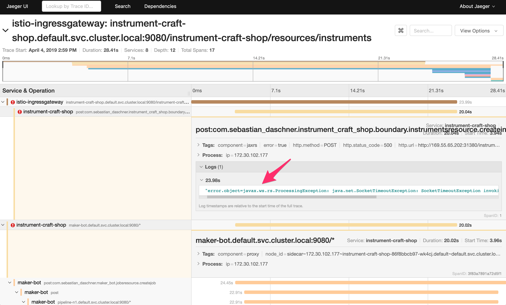

If we follow the `x-request-id` value from the envoy trace entry for that process, we can use that to locate the specific invocation of this request. 

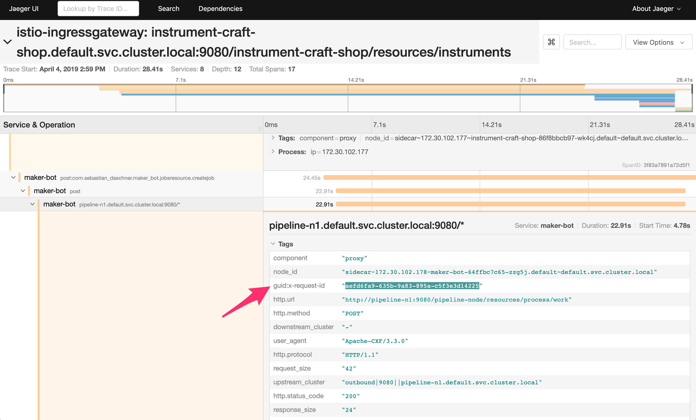

Normally, you would want to aggregate your logs in a central location [link to Cloud LogDNA service here] but for the purpose of our demo, we can check the pod with `kubectl logs` and filter by request-id. We find it ran for 19370ms, causing a connection error in the top level `maker-bot` service, which has client connections set to timeout after 20 seconds.

```

$ kubectl logs pipeline-n1-694c45bb8b-8nlns pipeline-node | grep -C6 aefd6fa9-635b-9a83-895a-c5f3e3d14225
Accept: */*
User-Agent: Apache-CXF/3.3.0
Cache-Control: no-cache
Pragma: no-cache
Content-Length: 42
X-Forwarded-Proto: http
x-request-id: aefd6fa9-635b-9a83-895a-c5f3e3d14225
x-envoy-decorator-operation: pipeline-n1.default.svc.cluster.local:9080/*
x-istio-attributes: Cj8KCnNvdXJjZS51aWQSMRIva3ViZXJuZXRlczovL21ha2VyLWJvdC02NGZmYmM3YzY1LXp6ZzVqLmRlZmF1bHQKPgoTZGVzdGluYXRpb24uc2VydmljZRInEiVwaXBlbGluZS1uMS5kZWZhdWx0LnN2Yy5jbHVzdGVyLmxvY2FsCkEKF2Rlc3RpbmF0aW9uLnNlcnZpY2UudWlkEiYSJGlzdGlvOi8vZGVmYXVsdC9zZXJ2aWNlcy9waXBlbGluZS1uMQpDChhkZXN0aW5hdGlvbi5zZXJ2aWNlLmhvc3QSJxIlcGlwZWxpbmUtbjEuZGVmYXVsdC5zdmMuY2x1c3Rlci5sb2NhbAoqCh1kZXN0aW5hdGlvbi5zZXJ2aWNlLm5hbWVzcGFjZRIJEgdkZWZhdWx0CikKGGRlc3RpbmF0aW9uLnNlcnZpY2UubmFtZRINEgtwaXBlbGluZS1uMQ==
doWork process time = 19370 ms
[err]   at javax.servlet.http.HttpServlet.service(HttpServlet.java:706)
[err]   at com.ibm.websphere.jaxrs.server.IBMRestServlet.service(IBMRestServlet.java:96)
[err]   at [internal classes]
```

With the help of distributed tracing, the entire process of finding the longest running request and locating its logs took seconds. 

The `x-request-id` value is injected by Istio header can be forwarded as well, but if left alone can still be useful by as a way to locate individual service requests, as tracing does not record detailed error messages or stack traces.

More details about Envoy's use of HTTP header fields can be found [here](https://www.envoyproxy.io/docs/envoy/latest/intro/arch_overview/tracing#arch-overview-tracing).


Note: Because the traces don't retain information about path parameters or payload bodies, separating REST operations by URL helps to identify what was going on by quickly glancing at the trace UI.

Error Scenario: misconfiguration
------------------------

To begin with, we'll look at a relatively simple situation: for some reason, a service is unavailable.
In a microservice environment, sometimes, a service isn't ready, or has failed for some purpose. Another service attempting to call this service will get an error.  This jumps out immediately in the distributed tracing system as some spans just don't appear.  In this case, a pipeline node did not complete its startup and the web application was not ready to receive requests.  We can see it's missing from the trace entirely and if we dig deeper we find a "404" message in the maker-bot:


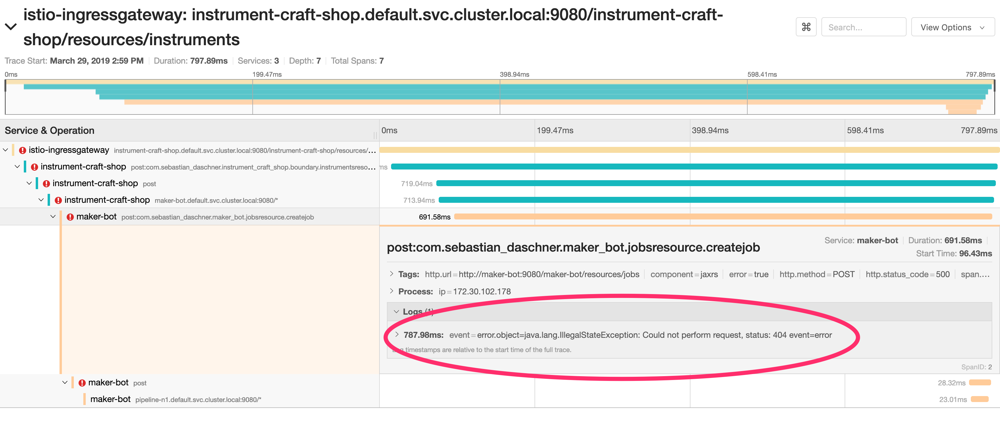

The specific error message is available due to MicroProfile OpenTracing reporting the error to the trace collector.

Error Scenario: run-time application failure
--------------------------

Lastly, let's take a look at a typical application error. 

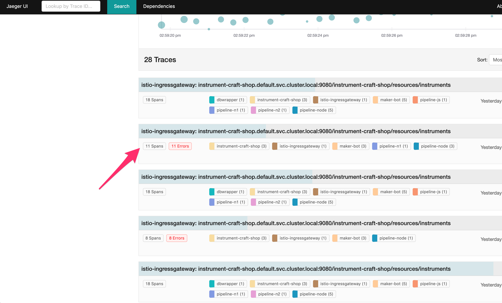

We can see how an error in one pipeline process ripples up through the call chain so you can follow it to the initial request that triggered the sequence.

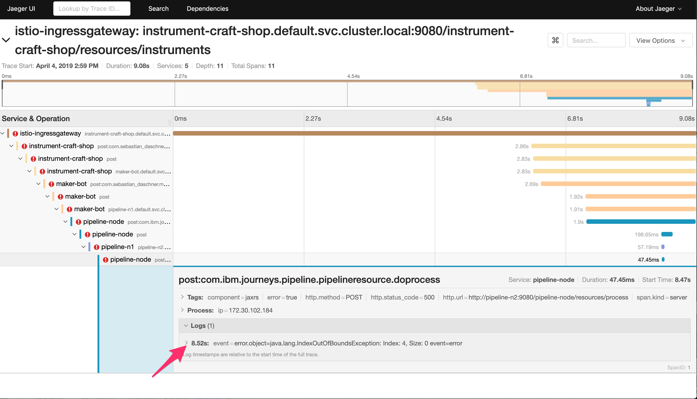

If we check the Envoy proxy's span one level above the JAX-RS span, we find the request-id that was injected into the HTTP header, making it possible to locate the specific Java stack trace (and more error details) in your centralized logging system.

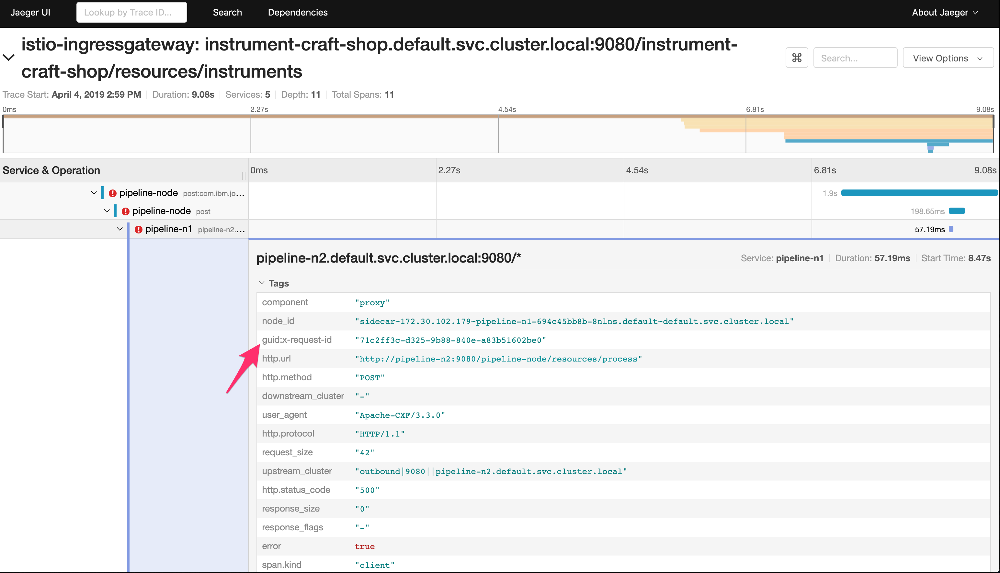

# Conclusion

In this pattern, we set up a Kubernetes cluster, installed the Istio service mesh, and added tracing instrumentation to our microservice application.

As we saw, Istio mesh adds observability, but it's not completely "free", as applications do need to instrument their code.  We saw how Open Liberty's MicroProfile can simplify implementing end-to-end tracing across a microservice application.  A toolkit like Open Liberty's MicroProfile and JAX-RS that allows automatic span creation reduces the chance that important information is lost due to gaps in recorded traces.


# References
[Istio.io](https://istio.io/docs/tasks/)

More about Open Liberty and mpOpenTracing on the [official blog](https://openliberty.io/guides/microprofile-opentracing.html#getting-started)

# License
[Apache 2.0](http://www.apache.org/licenses/LICENSE-2.0)
